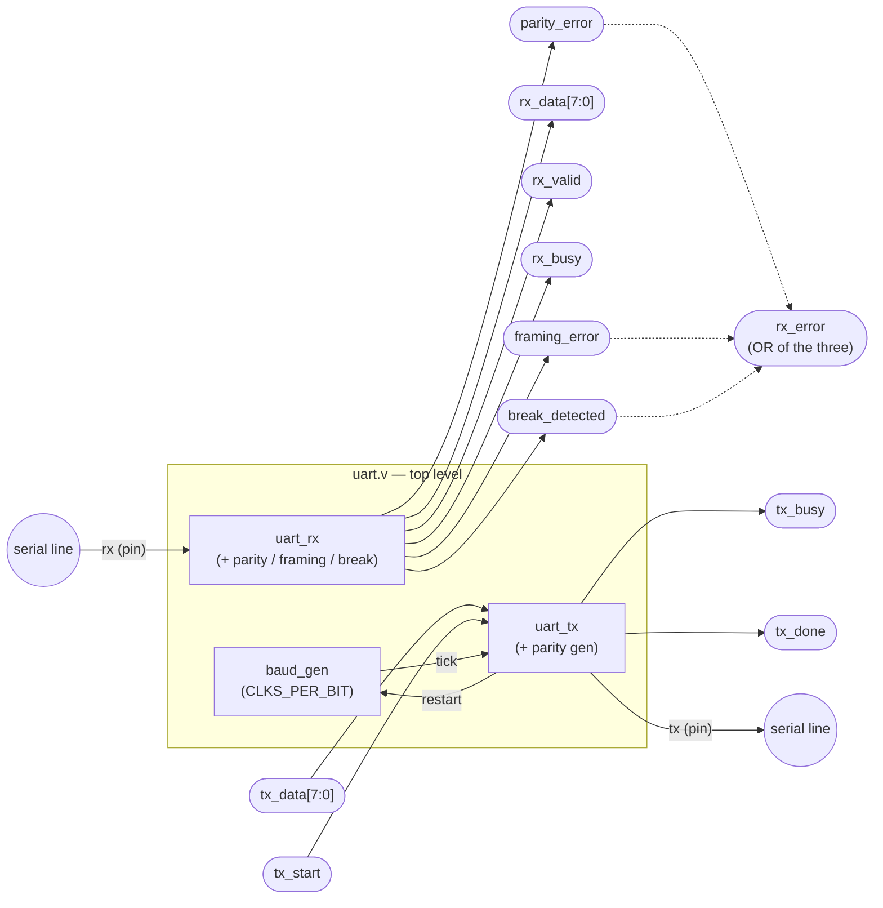
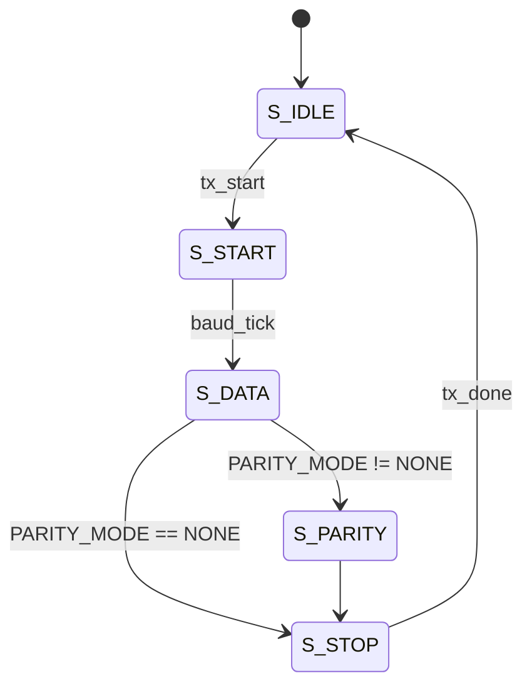
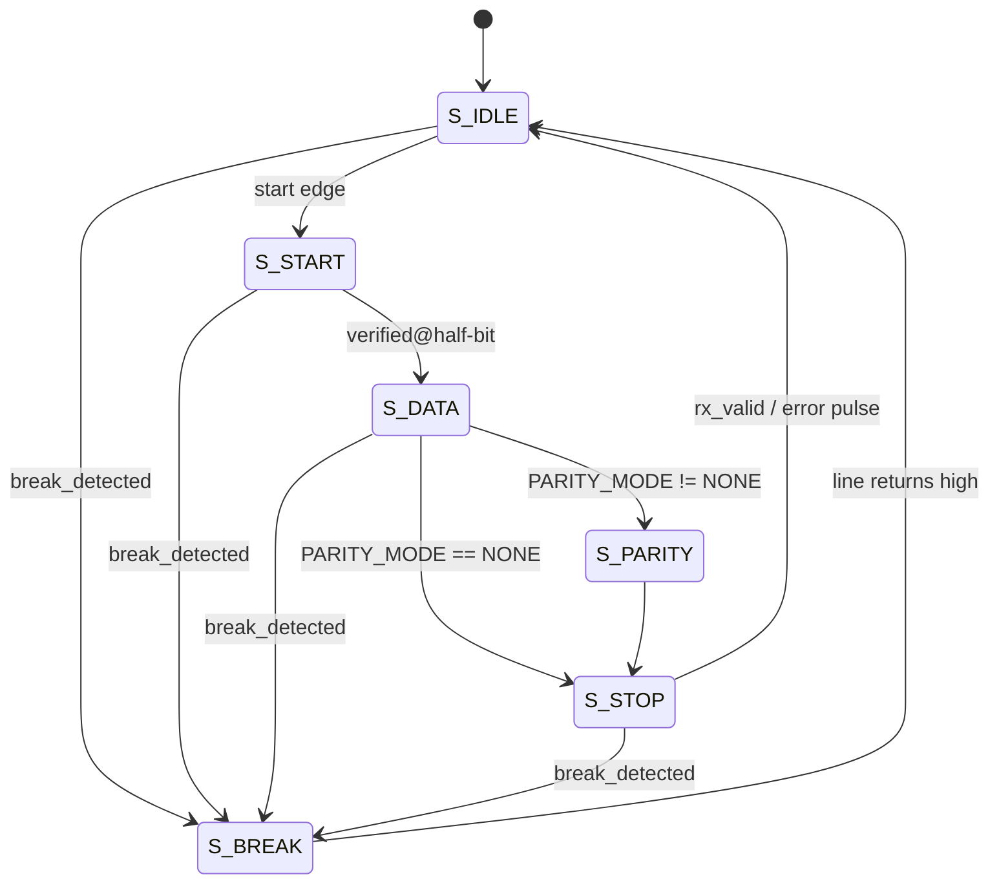

# UART Communication System -- Phase 2: Parity, Framing, and Break Detection


A modular, synthesizable 8-bit UART transmitter/receiver written in plain
Verilog (no SystemVerilog, no vendor primitives) — with configurable
parity (NONE / EVEN / ODD), framing-error detection, and break-condition
detection, verified against two independent reference models and a
1,900+ check regression suite.


---

## Table of contents

- [Overview](#overview)
- [Features](#features)
- [Architecture](#architecture)
- [Frame format](#frame-format)
- [TX / RX finite state machines](#tx--rx-finite-state-machines)
- [Repository layout](#repository-layout)
- [Getting started](#getting-started)
- [Verification](#verification)
- [Design philosophy](#design-philosophy)
- [Project history: Phase 1 → Phase 2](#project-history-phase-1--phase-2)
- [Documentation](#documentation)

---

## Overview

This repository implements a UART (Universal Asynchronous
Receiver/Transmitter) peripheral entirely in synthesizable Verilog:
a baud-rate generator, a transmitter FSM, a receiver FSM, and a
top-level module that wires them together and shares configuration
between both directions of the link.


It's built in two documented phases:

1. **Foundation** — TX/RX/loopback with clean-frame timing only.
2. **Parity, framing, and break detection** (current) — configurable
   parity, framing-error detection, and break-condition detection, all
   specified down to an exact behavioral table and verified with two
   independent reference models.

Every design decision — not just what was built, but *why*, and what
alternatives were rejected — is written down in [`docs/architecture.md`](docs/architecture.md).
Every test and every claim of correctness is written down in
[`docs/verification.md`](docs/verification.md).

## Features

- **8 data bits, LSB-first**, 1 start bit, 1 stop bit — classic UART framing.
- **Configurable parity** — `NONE` / `EVEN` / `ODD`, set once at the
  top level and shared by both TX and RX so the two ends of a link can
  never be configured to disagree.
- **Framing-error detection** — flags a byte whose stop bit doesn't
  read back `1`.
- **Break-condition detection** — a dedicated free-running counter
  distinguishes a genuine break (line held low for longer than any
  legitimate frame could last) from an ordinary start bit.
- **Fully specified error semantics** — a complete behavioral table
  (`docs/architecture.md`, Section 9) covers every combination of
  clean / parity-error / framing-error / break / reset-mid-frame.
- **Two-flip-flop synchronizer** on the asynchronous `rx` input.
- **Self-checking testbenches** that inspect the actual serial line's
  bit timing and ordering, not just the final received byte.
- **Two independent reference models** — a structurally different
  Verilog-side parity calculation, and a separate Python vector
  generator — so a bug in the RTL's own math can't hide from its own check.
- **One-command regression** (`make regression`) with a single
  pass/fail summary, CI-friendly exit status.

## Architecture



| Module | File | Responsibility |
|---|---|---|
| `baud_gen` | `rtl/baud_gen.v` | Produces one `tick` every `CLKS_PER_BIT` cycles; restartable to phase-align a new frame. |
| `uart_tx` | `rtl/uart_tx.v` | Serializes data bits + optional parity + stop bit. Computes parity once, at latch time. |
| `uart_rx` | `rtl/uart_rx.v` | Deserializes, center-samples every field, validates parity and the stop bit, detects break conditions. |
| `uart` | `rtl/uart.v` | Top-level integration; shares `PARITY_MODE` between TX and RX; aggregates error outputs. |
| `uart_defs.vh` | `rtl/uart_defs.vh` | Shared `` `include ``-d `PARITY_MODE` encoding, used by every RTL file and every testbench. |

Full interface listings, parameter tables, and the rationale behind
every one of the above (including why `uart.v` needs a `generate`
block and nothing else does) live in
[`docs/architecture.md`](docs/architecture.md).

## Frame format

```
Idle ─┬─ Start ─┬───────────── 8 data bits (LSB first) ─────────────┬─ [Parity] ─┬─ Stop ─┬─ Idle
 1    │    0    │  d0  d1  d2  d3  d4  d5  d6  d7                   │  optional  │   1    │  1
      └─────────┴───────────────────── one bit period each, exactly CLKS_PER_BIT cycles wide ─────────┘
```

- Idle line level is `1`; a frame begins the instant the line falls to `0`.
- The parity field is present only when `PARITY_MODE != NONE`; its
  position is otherwise just one more state in the same tick-driven
  sequence as the data bits, so its timing needs no special-casing.
- Every field is sampled/driven for exactly `CLKS_PER_BIT` cycles —
  see `docs/architecture.md` Section 7 for the timing derivation and
  the measured baud-rate error at 50 MHz / 115200 baud.

## TX / RX finite state machines

<table>
<tr><th>Transmitter</th><th>Receiver</th></tr>
<tr><td>



</td><td>



</td></tr>
</table>

`break_detected` is driven by a **separate, free-running counter** that
tracks how long the line has been continuously low, independent of
whatever state the frame FSM is in — see `docs/architecture.md` Section 6
for exactly why that independence is required and how the threshold is
derived.

## Repository layout

```
uart/
├── rtl/
│   ├── uart_defs.vh    -- shared PARITY_MODE encoding (`include`d everywhere)
│   ├── baud_gen.v        -- bit-timing / baud tick generator
│   ├── uart_tx.v           -- transmitter FSM (+ parity generation)
│   ├── uart_rx.v             -- receiver FSM (+ parity/framing/break detection)
│   └── uart.v                  -- top-level integration
│
├── tb/
│   ├── uart_tasks.v     -- shared testbench tasks + independent Verilog parity model
│   ├── uart_tb.v          -- self-checking loopback testbench (3 parity-mode DUTs)
│   ├── uart_tx_tb.v         -- TX unit testbench
│   ├── uart_rx_tb.v           -- RX unit testbench (primary home for fault injection)
│   ├── uart_vectors_tb.v        -- replays Python-generated reference vectors
│   └── vectors/
│       └── random_vectors.txt     -- generated by scripts/gen_vectors.py
│
├── scripts/
│   └── gen_vectors.py   -- independent Python reference model + vector generator
│
├── docs/
│   ├── architecture.md  -- full architecture, FSMs, timing, parity/framing/break, error-semantics table
│   └── verification.md    -- test methodology, full test inventory, coverage philosophy, sim instructions
│
├── Makefile
└── README.md (this file)
```

This is a direct continuation of an earlier phase (preserved as
`*.phase1.bak` files throughout this tree) that already had working
TX/RX/loopback with no error handling. See `docs/architecture.md` Section
1 for a review of that earlier design's assumptions and what specifically
needed to change to support this phase.

## What's new in this phase

- **Configurable parity**: `PARITY_MODE` parameter (NONE / EVEN / ODD),
  shared between TX and RX by the top-level `uart` module so the two
  sides of a link can't be configured to disagree.
- **Parity error detection**: RX independently recomputes the expected
  parity bit from the data it received and flags `parity_error` if it
  doesn't match.
- **Framing error detection**: RX flags `framing_error` if the stop bit
  doesn't read back `1`.
- **Break detection**: RX flags `break_detected` (a level, not a pulse)
  when the line stays continuously low for longer than one full frame
  could ever legitimately last -- explicitly *not* just `rx == 0`, which
  would misclassify an ordinary start bit as a break.
- **Explicit, non-ambiguous error semantics**: a full behavioral table in
  `docs/architecture.md` Section 9 specifies exactly what `rx_data`,
  `rx_valid`, and every error signal do in every combination of clean/
  parity-error/framing-error/break/reset-mid-frame.
- **Fault injection as a first-class part of verification**: the RX unit
  testbench deliberately drives malformed frames (bad parity, bad stop
  bit, sub-half-bit glitches, break conditions of varying duration) and
  checks the receiver correctly rejects each one.
- **Two independent reference models**: a structurally-different
  Verilog-side parity calculation (bit-counting loop vs. the RTL's
  reduction-XOR), and a fully separate Python program that predicts
  expected outcomes for randomized vectors and hands them to Verilog to
  replay -- see `docs/verification.md` Section 2 for why two, and why
  each independently satisfies "don't just reuse the DUT's own logic."
- **A Makefile-based build/regression flow** (`make regression`), so the
  whole verification suite runs with one command and produces one
  pass/fail summary.

## How to simulate

Requires [Icarus Verilog](http://iverilog.icarus.com/) (`iverilog`/`vvp`)
and Python 3 (used only by the vector generator, not by the RTL or core
simulation flow).

```sh
make regression      # everything: compile, generate vectors, run all 4 testbenches
```

or run pieces individually:

```sh
make compile          # elaborate all four testbenches
make sim_top             # tb/uart_tb.v        -- loopback, 3 parity modes
make sim_tx                # tb/uart_tx_tb.v      -- TX unit test
make sim_rx                   # tb/uart_rx_tb.v       -- RX unit test, fault injection
make sim_vectors                 # tb/uart_vectors_tb.v   -- Python-vector regression
make vectors SEED=999 NVEC=500      # regenerate vectors with a different seed/count
make waves TB=uart_rx_tb               # VCD waveform dump for a given testbench
make clean                                # remove build/ artifacts
```

As of the last run against this exact source (Icarus Verilog 12.0):

```
uart_tb          : 1407 / 1407 PASSED
uart_tx_tb        :  228 /  228 PASSED
uart_rx_tb          :   54 /   54 PASSED
uart_vectors_tb        :  248 /  248 PASSED
-------------------------------------------------
TOTAL                     : 1937 / 1937 PASSED
```

See `docs/verification.md` for the full test inventory mapped against
every category the assignment asked for (normal operation, parity,
framing, break, reset, and combined scenarios), plus simulator-agnostic
notes on adapting this flow to Verilator or a commercial simulator if
Icarus isn't available in a given environment.

## Design philosophy (carried forward and extended)

- One responsibility per module; still no "do everything" UART module.
  `uart_defs.vh` exists specifically so the PARITY_MODE encoding has one
  authoritative source instead of being repeated (and risking drifting
  out of sync) across `uart_tx.v`, `uart_rx.v`, `uart.v`, and every
  testbench.
- Every ambiguous behavior the assignment called out by name --
  particularly framing-error semantics (Section 5), break detection's
  exact threshold and level-vs-pulse choice (Section 6), and the full
  error-combination behavioral table (Section 9) -- is written down
  explicitly in `docs/architecture.md`, not left for the RTL to speak for
  itself.
- No premature optimization: still integer-division baud generation
  (documented, calculated error), still no FIFOs (explicitly out of scope
  for this phase), still no configurable stop-bit count (also explicitly
  out of scope, since the assignment specifically discouraged it without
  a clear need).
- "A feature is complete only when it is both implemented AND verified"
  (this project's own working rule, restated from the assignment): every
  new RTL behavior added this phase has a corresponding named test, and
  the handful of subtle testbench-only bugs found along the way (see
  `docs/verification.md`'s methodology notes, and the `uart_rx_tb.v`
  fault-injection driver comments) were found by actually running the
  simulation and reading timestamps, not by inspection.

See `docs/architecture.md` for the full technical write-up and
`docs/verification.md` for the full verification write-up.
