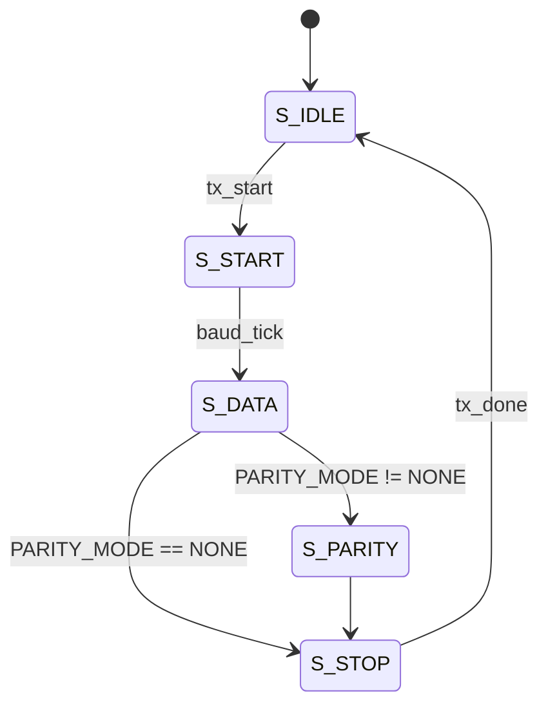
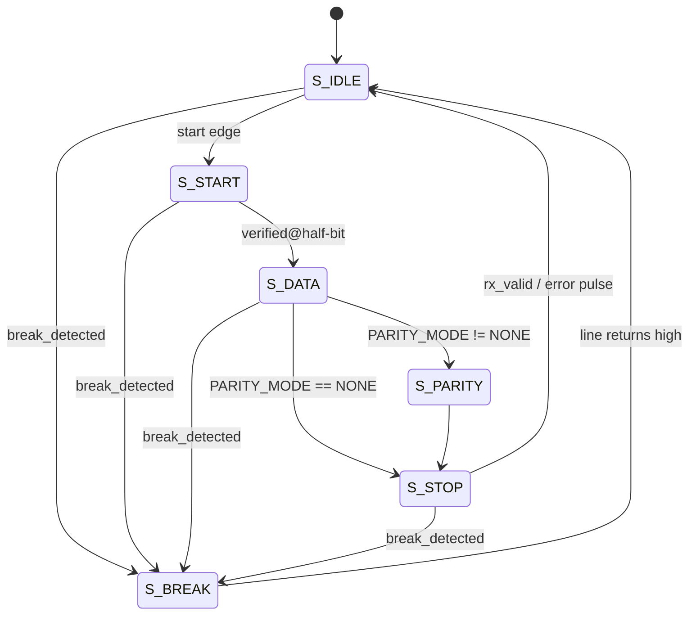
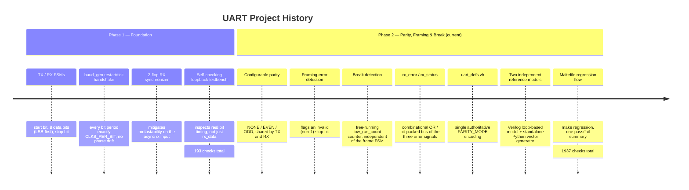

# 8-bit UART Communication System in Verilog HDL

A modular, synthesizable 8-bit UART transmitter/receiver written in plain
Verilog (no SystemVerilog, no vendor primitives) — with configurable
parity (NONE / EVEN / ODD), framing-error detection, and break-condition
detection, verified against two independent reference models and a
1,900+ check regression suite.


---

## Table of contents

- [Overview](#overview)
- [Features](#features)
- [Architecture](#architecture)
- [Frame format](#frame-format)
- [TX / RX finite state machines](#tx--rx-finite-state-machines)
- [Repository layout](#repository-layout)
- [Getting started](#getting-started)
- [Verification](#verification)
- [Design philosophy](#design-philosophy)
- [Project history: Phase 1 → Phase 2](#project-history-phase-1--phase-2)
- [Documentation](#documentation)

---

## Overview

This repository implements a UART (Universal Asynchronous
Receiver/Transmitter) peripheral entirely in synthesizable Verilog:
a baud-rate generator, a transmitter FSM, a receiver FSM, and a
top-level module that wires them together and shares configuration
between both directions of the link.

It's built in two documented phases:

1. **Foundation** — TX/RX/loopback with clean-frame timing only.
2. **Parity, framing, and break detection** (current) — configurable
   parity, framing-error detection, and break-condition detection, all
   specified down to an exact behavioral table and verified with two
   independent reference models.

Every design decision — not just what was built, but *why*, and what
alternatives were rejected — is written down in [`docs/architecture.md`](docs/architecture.md).
Every test and every claim of correctness is written down in
[`docs/verification.md`](docs/verification.md).

## Features

- **8 data bits, LSB-first**, 1 start bit, 1 stop bit — classic UART framing.
- **Configurable parity** — `NONE` / `EVEN` / `ODD`, set once at the
  top level and shared by both TX and RX so the two ends of a link can
  never be configured to disagree.
- **Framing-error detection** — flags a byte whose stop bit doesn't
  read back `1`.
- **Break-condition detection** — a dedicated free-running counter
  distinguishes a genuine break (line held low for longer than any
  legitimate frame could last) from an ordinary start bit.
- **Fully specified error semantics** — a complete behavioral table
  (`docs/architecture.md`, Section 9) covers every combination of
  clean / parity-error / framing-error / break / reset-mid-frame.
- **Two-flip-flop synchronizer** on the asynchronous `rx` input.
- **Self-checking testbenches** that inspect the actual serial line's
  bit timing and ordering, not just the final received byte.
- **Two independent reference models** — a structurally different
  Verilog-side parity calculation, and a separate Python vector
  generator — so a bug in the RTL's own math can't hide from its own check.
- **One-command regression** (`make regression`) with a single
  pass/fail summary, CI-friendly exit status.

## Architecture


| Module | File | Responsibility |
|---|---|---|
| `baud_gen` | `rtl/baud_gen.v` | Produces one `tick` every `CLKS_PER_BIT` cycles; restartable to phase-align a new frame. |
| `uart_tx` | `rtl/uart_tx.v` | Serializes data bits + optional parity + stop bit. Computes parity once, at latch time. |
| `uart_rx` | `rtl/uart_rx.v` | Deserializes, center-samples every field, validates parity and the stop bit, detects break conditions. |
| `uart` | `rtl/uart.v` | Top-level integration; shares `PARITY_MODE` between TX and RX; aggregates error outputs. |
| `uart_defs.vh` | `rtl/uart_defs.vh` | Shared `` `include ``-d `PARITY_MODE` encoding, used by every RTL file and every testbench. |

Full interface listings, parameter tables, and the rationale behind
every one of the above (including why `uart.v` needs a `generate`
block and nothing else does) live in
[`docs/architecture.md`](docs/architecture.md).

## Frame format

```
Idle ─┬─ Start ─┬───────────── 8 data bits (LSB first) ─────────────┬─ [Parity] ─┬─ Stop ─┬─ Idle
 1    │    0    │  d0  d1  d2  d3  d4  d5  d6  d7                   │  optional  │   1    │  1
      └─────────┴───────────────────── one bit period each, exactly CLKS_PER_BIT cycles wide ─────────┘
```

- Idle line level is `1`; a frame begins the instant the line falls to `0`.
- The parity field is present only when `PARITY_MODE != NONE`; its
  position is otherwise just one more state in the same tick-driven
  sequence as the data bits, so its timing needs no special-casing.
- Every field is sampled/driven for exactly `CLKS_PER_BIT` cycles —
  see `docs/architecture.md` Section 7 for the timing derivation and
  the measured baud-rate error at 50 MHz / 115200 baud.

## TX / RX finite state machines

<table>
<tr><th>Transmitter</th><th>Receiver</th></tr>
<tr><td>



</td><td>



</td></tr>
</table>

`break_detected` is driven by a **separate, free-running counter** that
tracks how long the line has been continuously low, independent of
whatever state the frame FSM is in — see `docs/architecture.md` Section 6
for exactly why that independence is required and how the threshold is
derived.

## Repository layout

```
.
├── rtl/
│   ├── uart_defs.vh   -- shared PARITY_MODE encoding, `include`d everywhere
│   ├── baud_gen.v     -- bit-timing / baud tick generator
│   ├── uart_tx.v      -- transmitter FSM (+ parity generation)
│   ├── uart_rx.v      -- receiver FSM (+ parity / framing / break detection)
│   └── uart.v         -- top-level integration
│
├── tb/
│   ├── uart_tasks.v       -- shared testbench tasks + independent Verilog parity model
│   ├── uart_tb.v          -- self-checking loopback testbench (3 parity-mode DUTs)
│   ├── uart_tx_tb.v       -- TX unit testbench
│   ├── uart_rx_tb.v       -- RX unit testbench (fault injection lives here)
│   ├── uart_vectors_tb.v  -- replays Python-generated reference vectors
│   └── vectors/
│       └── random_vectors.txt  -- generated by scripts/gen_vectors.py
│
├── scripts/
│   └── gen_vectors.py     -- independent Python reference model + vector generator
│
├── docs/
│   ├── architecture.md    -- full architecture, FSMs, timing, error semantics
│   ├── verification.md    -- methodology, full test inventory, coverage, sim instructions
│   └── CHANGELOG.md        -- what changed between phases, and why
│
├── phase1_reference/      -- earlier TX/RX/loopback-only phase, kept for comparison
│   └── ...
│
├── Makefile
├── LICENSE
└── README.md               -- this file
```

## Getting started

Requires [Icarus Verilog](http://iverilog.icarus.com/) (`iverilog` /
`vvp`) and Python 3 (used only by the vector generator, not by the
RTL or the core simulation flow).

```sh
git clone https://github.com/<your-username>/8-bit-UART-Communication-System-in-Verilog-HDL.git
cd 8-bit-UART-Communication-System-in-Verilog-HDL
make regression      # compile everything, generate vectors, run all 4 testbenches
```

Or run pieces individually:

```sh
make compile                          # elaborate all four testbenches
make sim_top                          # tb/uart_tb.v        -- loopback, 3 parity modes
make sim_tx                           # tb/uart_tx_tb.v     -- TX unit test
make sim_rx                           # tb/uart_rx_tb.v     -- RX unit test, fault injection
make sim_vectors                      # tb/uart_vectors_tb.v -- Python-vector regression
make vectors SEED=999 NVEC=500        # regenerate vectors with a different seed/count
make waves TB=uart_rx_tb              # VCD waveform dump for a given testbench
make clean                            # remove build/ artifacts
```

## Verification

As of the last run against this exact source (Icarus Verilog 12.0):

| Testbench | Result | Focus |
|---|---|---|
| `uart_tb` | 1407 / 1407 passed | Full-link loopback, 3 parity modes, complete 0x00–0xFF sweep |
| `uart_tx_tb` | 228 / 228 passed | TX unit test, line-level parity capture |
| `uart_rx_tb` | 54 / 54 passed | RX unit test — the primary home for fault injection |
| `uart_vectors_tb` | 248 / 248 passed | Python-generated reference-vector regression |
| **Total** | **1937 / 1937 passed** | |

Every scenario the design is expected to handle — normal traffic,
parity errors, framing errors, break conditions, reset mid-frame, and
every combination of the above — is mapped to a named test in
[`docs/verification.md`](docs/verification.md), including a
line-by-line correspondence between the architecture's behavioral
table and the tests that exercise each row.

## Design philosophy

- **One responsibility per module.** No "do everything" UART module;
  `uart_defs.vh` exists specifically so shared constants have one
  authoritative source instead of drifting out of sync across files.
- **Nothing ambiguous is left for the RTL to speak for itself.**
  Framing-error semantics, break detection's exact threshold, and the
  full error-combination behavioral table are all written down
  explicitly in `docs/architecture.md`.
- **No premature optimization.** Integer-division baud generation
  (documented, calculated error), no FIFOs, no configurable stop-bit
  count — all explicitly out of scope for this phase, not oversights.
- **A feature is complete only when it is implemented *and* verified.**
  Every new RTL behavior has a corresponding named test, verified by
  actually running simulation, not by inspection.

## Project history: Phase 1 → Phase 2



| | Phase 1 — Foundation | Phase 2 — Parity, Framing & Break *(current)* |
|---|---|---|
| Framing | 8-N-1, fixed | 8 data bits + configurable parity (NONE/EVEN/ODD) |
| Error handling | None — malformed frames silently accepted | Parity error, framing error, and break detection, each independently flagged |
| Reference models | Loopback self-check only | + independent Verilog parity model, + independent Python vector generator |
| Build flow | Manual `iverilog`/`vvp` invocations | `Makefile`-based (`make regression`) |
| Checks | 193 total | 1937 total |

The original phase-1 sources are preserved unmodified under
[`phase1_reference/`](phase1_reference/) for comparison. See
[`docs/CHANGELOG.md`](docs/CHANGELOG.md) for the itemized diff between
phases, and `docs/architecture.md` Section 1 for the review of phase 1's
assumptions that motivated phase 2's design.

## Documentation

| Document | Contents |
|---|---|
| [`docs/architecture.md`](docs/architecture.md) | Module inventory, interfaces, parity math, framing/break semantics, timing derivation, metastability discussion, full error-behavior table, design alternatives considered |
| [`docs/verification.md`](docs/verification.md) | Testbench architecture, why two independent reference models, full test inventory mapped to requirements, coverage philosophy, simulation instructions, known limitations, future work |
| [`docs/CHANGELOG.md`](docs/CHANGELOG.md) | What changed between Phase 1 and Phase 2, and why |
| [`phase1_reference/README.md`](phase1_reference/README.md) | Standalone documentation for the earlier foundation phase |


